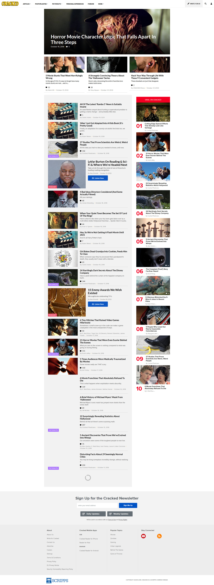
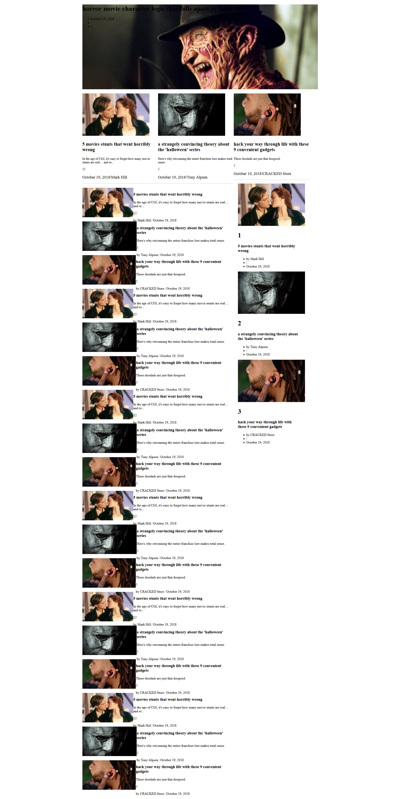

# Cracked

This project was generated with [Angular CLI](https://github.com/angular/angular-cli) version 7.0.1.

## planning

  * use angular CLI to generate project with scss isntead of css
    * completed
  * create featured articles section (big featured article and smaller featured articles will probably be separate components)
    * completed
  * create articles list (articles will probably be components)
    * completed
  * create side bar
    * completed
  * create top bar
  * articles will all have the same class
    * sort of
### planning phase 2
  * start using firebase to store articles
    * completed
  * deploy to firebase


## setup

* ```
git clone https://github.com/CGosser/friday-9.git
cd fakepath/friday-9
npm install
```
* create a file named api-keys.ts in the src/app folder
* set up a firebase account by going to https://firebase.google.com and create a project
* add the code in the following format to api-keys.ts from the firebase console which you can find by clicking on the button labeled </>
  ```
  export const masterFirebaseConfig = {
      apiKey: "xxxx",
      authDomain: "xxxx.firebaseapp.com",
      databaseURL: "https://xxxx.firebaseio.com",
      storageBucket: "xxxx.appspot.com",
      messagingSenderId: "xxxx"
    };
  ```
* in firebase's console click database on the left
* then click create database
* then click the "cloud firestore beta" button and change it to realtime database
* then click the three dots on the right and navigate to the articles.json and select it
* then run `ng serve --open`

OR just connect to https://cracked-7a674.firebaseapp.com/
## screenshots

### a screenshot of the website I am copying


### screenshot of my website as it currently is

